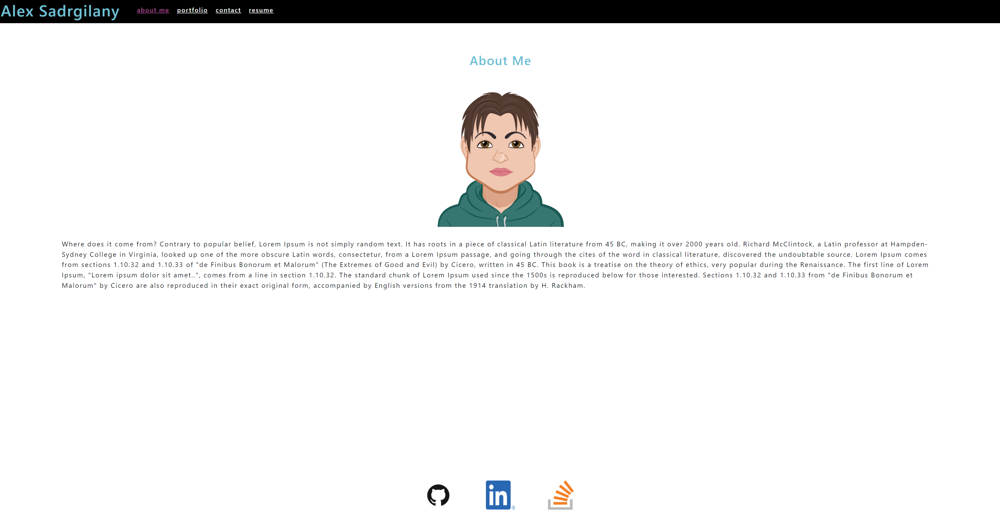
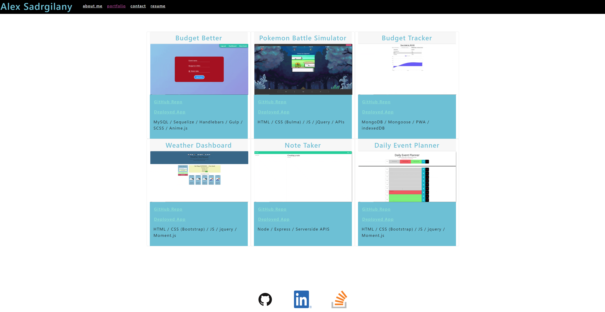
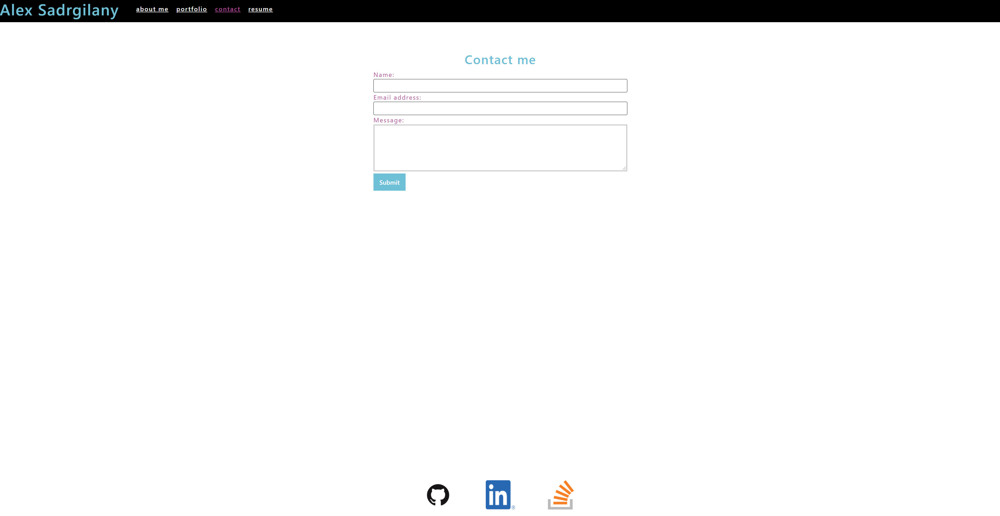
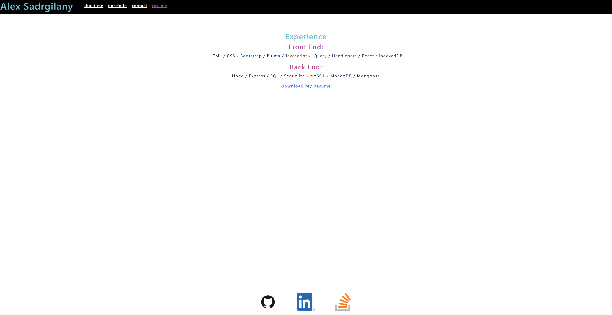

[](https://opensource.org/licenses/MIT)

# React Portfolio

## Description

This project was created in order to utilize the React Application to create a dynamic single page Portfolio. The portfolio takes advantage of react-router-dom to render different components based on what a user clicks in the navbar. The application also uses one component as a template to fill with specific information within another component (Project -> Portfolio components). The content of this application is mostly placeholders, save for the projects that are all mine. A proper resume will be created and uploaded in the future, along with a proper about me.

## Deployed Application

https://asadg7.github.io/react-portfolio/

## Table of Contents

* [Screenshots](#screenshots)
* [Installation](#installation)
* [Usage](#usage)
* [License](#license)
* [Questions](#questions)

## Screenshots

About Me



Portfolio



Contact Me



Resume



## Installation

There are a few different steps to getting this application installed and ready to go on your local machine.

Step 1: Clone this repo onto your local machine.

Step 2: Navigate to this project's root directory in your terminal and run the following installation command

```
npm install
```


## Usage

Continuing from the installation instructions, the following steps will help you use this application.


Step 3: After installing all dependencies, you may invoke the application using:

```
npm start
```

Step 4: Navigate to localhost:3000/react-portfolio in order to use the application locally.

## License

Copyright 2021 Alex Sadrgilany

Permission is hereby granted, free of charge, to any person obtaining a copy 
of this software and associated documentation files (the "Software"), to deal 
in the Software without restriction, including without limitation the rights to 
use, copy, modify, merge, publish, distribute, sublicense, and/or sell copies of the 
Software, and to permit persons to whom the Software is furnished to do so, 
subject to the following conditions:

The above copyright notice and this permission notice shall be included in all 
copies or substantial portions of the Software.

THE SOFTWARE IS PROVIDED "AS IS", WITHOUT WARRANTY OF ANY KIND, EXPRESS OR IMPLIED, 
INCLUDING BUT NOT LIMITED TO THE WARRANTIES OF MERCHANTABILITY, FITNESS FOR A 
PARTICULAR PURPOSE AND NONINFRINGEMENT. IN NO EVENT SHALL THE AUTHORS OR COPYRIGHT 
HOLDERS BE LIABLE FOR ANY CLAIM, DAMAGES OR OTHER LIABILITY, WHETHER IN AN ACTION OF 
CONTRACT, TORT OR OTHERWISE, ARISING FROM, OUT OF OR IN CONNECTION WITH THE SOFTWARE 
OR THE USE OR OTHER DEALINGS IN THE SOFTWARE.

## Questions

[My GitHub Profile](https://github.com/asadg7)

To reach me with questions, please email: asadrgilany7@gmail.com
